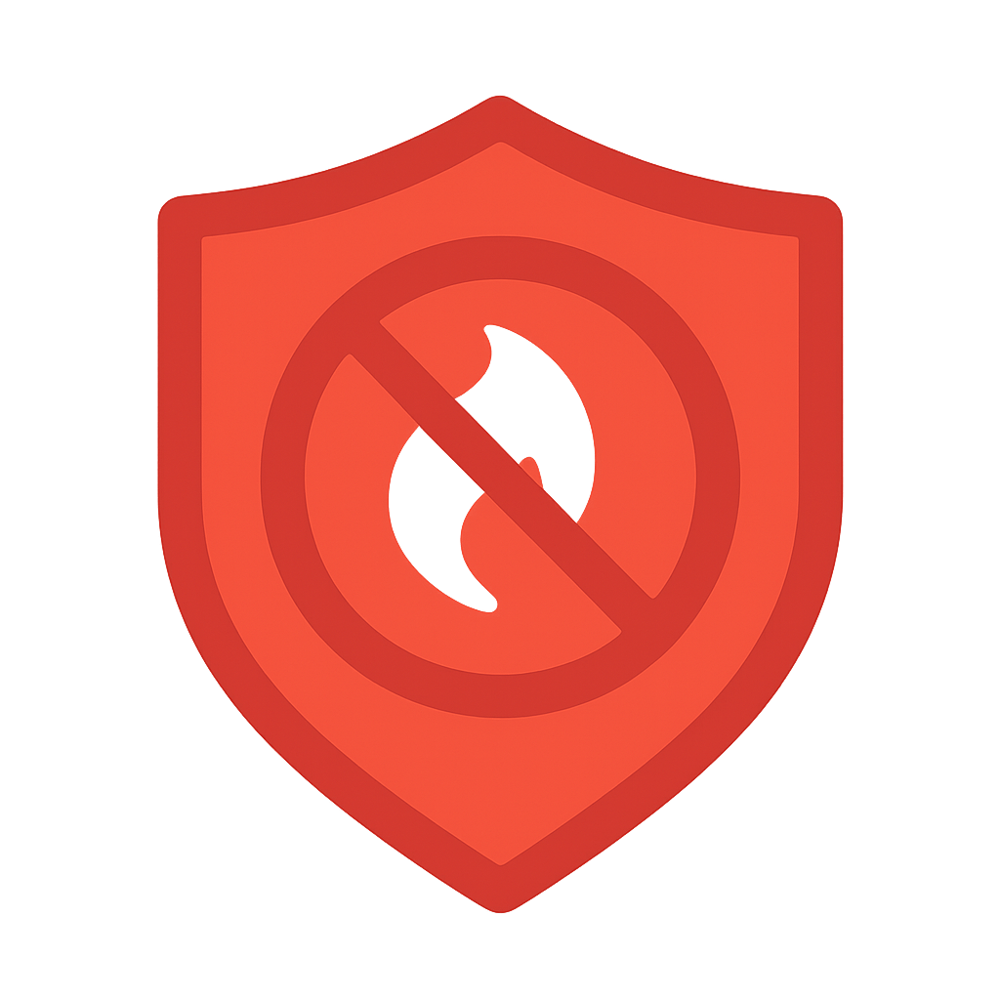

# Hotjar Blocker

<div align="center">
  
  <p><strong>Block Hotjar tracking. Protect your privacy.</strong></p>
  <p>
    <a href="https://github.com/blakazulu/hotjar-extensions">GitHub Repository</a> •
    <a href="#chrome-extension-installation">Chrome Installation</a> •
    <a href="#firefox-extension-installation">Firefox Installation</a>
  </p>
</div>

---

Browser extensions for Chrome and Firefox that block all network calls to/from Hotjar on any domains you choose.

## 🌐 Website

Visit our landing page: [Hotjar Blocker Website](https://hotjar-blocker.netlify.app) (deployed on Netlify)

## Design

Modern, clean interface with:
- **Light theme** with subtle gradients (#f5f7fa background)
- **Orange & Red** accent colors (#f97316 → #ef4444) throughout the UI
- **Bento Grid layout** for organized content display
- **Smart header** displaying protected domain count at a glance
- **Real-time status** with animated indicators showing protection state
- **Full-width domain management** for easy adding and viewing
- **Custom scrollbar** with gradient matching the theme
- **Smooth animations** and hover effects for better UX

## Chrome Extension Installation

1. Open Chrome browser
2. Navigate to `chrome://extensions/`
3. Enable **Developer mode** (toggle switch in the top-right corner)
4. Click **Load unpacked**
5. Browse to and select the `chrome` folder from this project
6. The extension is now installed and active

## Firefox Extension Installation

1. Open Firefox browser
2. Navigate to `about:debugging`
3. Click **This Firefox** in the left sidebar
4. Click **Load Temporary Add-on...**
5. Browse to the `firefox` folder and select the `manifest.json` file
6. The extension is now installed and active

**Note:** Firefox temporary add-ons are removed when you close Firefox. For permanent installation, you need to sign the extension through Mozilla Add-ons.

## Using the Extension

### Adding Domains

**Manual Entry:**
1. Click the extension icon in your browser toolbar
2. In the "Add Domain" section, enter a domain name (e.g., `example.com`)
3. Click the **+** button or press Enter
4. The extension will now block all Hotjar requests on that domain

**Quick Add (Current Site):**
1. Navigate to any website you want to protect
2. Click the extension icon
3. Click the **"Add Current Domain"** button
4. The current site's domain is automatically added to your protected list

**Managing Domains:**
- View your total protected domains count in the header (top-right)
- See all protected domains listed below the add section
- Click **Remove** next to any domain to stop protecting it
- Your domain list syncs across all your devices

### Viewing Blocking Status

**On-Page Notification:**
- When Hotjar is first blocked on a page, a beautiful toast notification appears in the top-right corner
- Shows number of requests blocked
- Automatically dismisses after 3 seconds
- Can be manually closed with the X button

**Extension Popup:**
1. Navigate to a protected domain
2. Click the extension icon
3. You'll see:
   - Current domain and protection status (✅ Protected or ⚠️ Not Protected)
   - Number of Hotjar requests blocked on this page
   - Red badge on the extension icon showing block count
   - Expandable list of all blocked URLs with request types
4. Click "Show blocked requests" to see detailed information about what was blocked

## Testing

1. Install the extension in your preferred browser
2. Add a domain using the popup interface
3. Navigate to the domain you added
4. Open Developer Tools (F12)
5. Go to the **Network** tab
6. Look for blocked/cancelled requests to Hotjar domains (`*.hotjar.com`, `*.hotjar.io`)

## Features

### Core Features
- ✅ **Dynamic Domain Management**: Add and remove domains on the fly
- ✅ **Quick Add Current Domain**: One-click button to protect the site you're currently viewing
- ✅ **Real-Time Blocking Status**: See exactly what's being blocked when you click the extension icon
- ✅ **On-Page Notifications**: Beautiful toast notification appears when Hotjar is blocked (auto-dismisses after 3 seconds)
- ✅ **Visual Feedback**: Badge counter shows number of blocked requests, domain count in header
- ✅ **Detailed Request List**: View all blocked Hotjar URLs with request types
- ✅ **Simple UI**: Beautiful, intuitive popup interface with modern orange/red gradient design
- ✅ **Persistent Storage**: Your domains are saved and synced across devices
- ✅ **Zero Configuration**: No complex settings, just add domains and go
- ✅ **Privacy Focused**: Blocks all Hotjar tracking scripts, analytics, and session recordings

### What Gets Blocked
- 📜 JavaScript tracking scripts
- 🌐 XHR/Fetch API requests
- 🔌 WebSocket connections
- 🖼️ Images and fonts
- 📊 Analytics data
- 🎥 Session recording data
- 🗺️ Heatmap tracking

## How It Works

### Chrome Extension
- Uses **Manifest V3** declarativeNetRequest API with dynamic rules for blocking
- Background service worker monitors and tracks blocked Hotjar requests
- Displays badge counter and detailed blocking statistics
- Stores protected domains using chrome.storage.sync

### Firefox Extension
- Uses **webRequest API** with blocking capabilities (maintained in Manifest V3)
- Background script intercepts and blocks requests in real-time
- Tracks all blocked requests with full details
- Displays badge counter and comprehensive blocking statistics
- Stores protected domains using browser.storage.sync

### Privacy & Performance
- All blocking happens locally in your browser
- No data is sent to external servers
- Minimal performance impact
- Domains sync across your devices (if signed into browser)
- Badge and statistics update in real-time

## Publishing to Chrome Web Store

### Prerequisites
1. **Google Account** with developer registration
2. **One-time $5 registration fee** to the Chrome Web Store Developer Program
3. **Screenshots** of the extension (1280x800 or 640x400)
4. **Promotional images** (optional but recommended)

### Step-by-Step Instructions

#### 1. Register as a Chrome Developer
1. Go to [Chrome Web Store Developer Dashboard](https://chrome.google.com/webstore/devconsole)
2. Sign in with your Google account
3. Pay the one-time $5 registration fee
4. Accept the developer agreement

#### 2. Prepare the Extension Package
1. Navigate to the `chrome` folder
2. Create a ZIP file containing all files:
   ```bash
   cd chrome
   zip -r hotjar-blocker.zip *
   ```
   **Or manually**: Select all files in the `chrome` folder and compress them into a ZIP file

#### 3. Create Store Listing
1. Go to the [Developer Dashboard](https://chrome.google.com/webstore/devconsole)
2. Click **New Item**
3. Upload your `hotjar-blocker.zip` file
4. Click **Upload**

#### 4. Fill Out Store Listing Details

**Store Listing Tab:**
- **Name**: Hotjar Blocker
- **Summary** (132 characters max): Block Hotjar tracking on any domain. Protect your privacy by blocking session recordings and analytics.
- **Description**:
  ```
  Hotjar Blocker gives you complete control over Hotjar tracking on your favorite websites.

  🛡️ FEATURES
  • Block Hotjar on any domain you choose
  • Quick "Add Current Domain" button for instant protection
  • Real-time blocking status and statistics
  • Beautiful, modern orange/red gradient interface
  • On-page notifications when blocking occurs
  • View detailed list of blocked requests
  • Sync your protected domains across devices

  🔒 PRIVACY FOCUSED
  • All blocking happens locally in your browser
  • No data sent to external servers
  • Zero tracking, zero analytics
  • Open source and transparent

  🚀 EASY TO USE
  1. Click the extension icon
  2. Add domains manually or click "Add Current Domain"
  3. That's it! Hotjar is now blocked on those domains

  ⚡ WHAT GETS BLOCKED
  • JavaScript tracking scripts
  • Session recordings
  • Heatmap tracking
  • Analytics data
  • WebSocket connections
  • All Hotjar-related requests

  Perfect for privacy-conscious users, developers, and anyone who wants control over their browsing experience.
  ```

- **Category**: Productivity or Privacy & Security
- **Language**: English

**Screenshots:**
- Take screenshots of the extension popup showing:
  - Empty state (no domains, showing the header with 0 protected)
  - Domain added (showing domain count in header)
  - Add Domain card with the full-width layout
  - Active blocking with counter and status indicator
  - Blocked requests list expanded showing details
  - "Add Current Domain" button highlighted
- Recommended size: 1280x800 or 640x400
- At least 1 screenshot required

**Privacy Tab:**
- **Single purpose**: Blocks Hotjar tracking scripts and network requests
- **Permissions justification**:
  - `declarativeNetRequest`: Required to block Hotjar network requests
  - `storage`: Required to save user's protected domains list
  - `webRequest`: Required to monitor and count blocked requests
  - `tabs`: Required to display blocking status for the current tab
  - `<all_urls>`: Required to monitor requests on all websites (only blocks Hotjar domains)

**Privacy policy**: (Create a simple page or use GitHub)
```
This extension does not collect, store, or transmit any personal data.
All domain blocking happens locally in your browser. The list of domains
you protect is stored locally using Chrome's sync storage and may sync
across your devices if you're signed into Chrome.
```

#### 5. Submit for Review
1. Click **Save draft**
2. Review all information
3. Click **Submit for review**
4. Wait for Google's review (typically 1-3 business days)

#### 6. After Approval
- Your extension will be published on the Chrome Web Store
- Users can install it directly from the store
- You can update it anytime by uploading a new ZIP with an incremented version number in `manifest.json`

### Tips
- **Icons**: The extension already has icons (16x16, 48x48, 128x128)
- **Version**: Start with version 1.0.0 and increment for updates
- **Updates**: Users get automatic updates when you publish new versions
- **Analytics**: Chrome provides download and usage statistics in the dashboard

## Publishing to Firefox Add-ons (AMO)

Firefox also requires registration and signing. Visit [addons.mozilla.org](https://addons.mozilla.org/developers/) for detailed instructions.

## 🌐 Website Deployment

The project includes a landing page (`website/` folder) deployed on Netlify.

### Website Structure
```
website/
├── index.html       # Landing page with hero, features, and CTA sections
├── styles.css       # Modern orange/red gradient styling
├── logo.webp        # Brand logo
├── favicon-*.png    # Browser icons
└── icon-*.png       # PWA icons
```

### Netlify Configuration
The `netlify.toml` file is configured to:
- Publish the `website/` folder
- Serve static HTML/CSS (no build step required)
- Work across production, deploy-preview, and branch-deploy contexts

### Local Development
1. Open `website/index.html` in a browser
2. No build process needed - it's pure HTML/CSS/JS

### Updating Store Links
Before publishing, update the placeholder links in `website/index.html` (lines 221-227):
```javascript
const chromeUrl = '#'; // Replace with Chrome Web Store URL
const firefoxUrl = '#'; // Replace with Firefox Add-ons URL
```

## 📁 Project Structure

```
├── chrome/              # Chrome extension (Manifest V3)
│   ├── manifest.json
│   ├── background.js
│   ├── content.js
│   ├── popup.html/css/js
│   └── icon*.png
├── firefox/             # Firefox extension (Manifest V3)
│   ├── manifest.json
│   ├── background.js
│   ├── content.js
│   ├── popup.html/css/js
│   └── icon*.png
├── website/             # Landing page (Netlify)
│   ├── index.html
│   ├── styles.css
│   └── assets/
├── assets/              # Design assets
│   ├── icons/          # Extension icons
│   ├── images/         # Logo files
│   └── store/          # Store listing images
├── netlify.toml        # Netlify deployment config
└── README.md           # This file
```

## 🤝 Contributing

Contributions are welcome! Please feel free to submit a Pull Request.

## 📄 License

This project is open source.

## 🔗 Links

- **GitHub**: https://github.com/blakazulu/hotjar-extensions
- **Website**: https://hotjar-blocker.netlify.app (update with actual URL)
- **Chrome Web Store**: (coming soon)
- **Firefox Add-ons**: (coming soon) 
